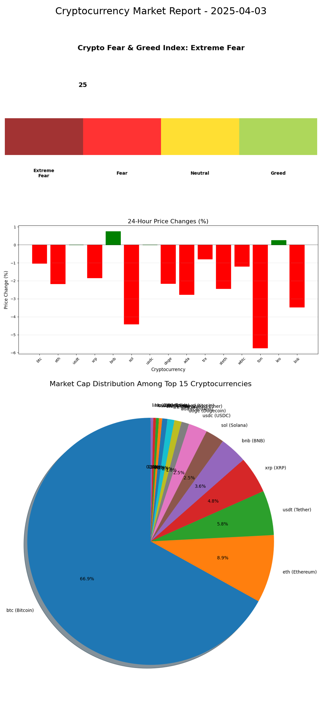
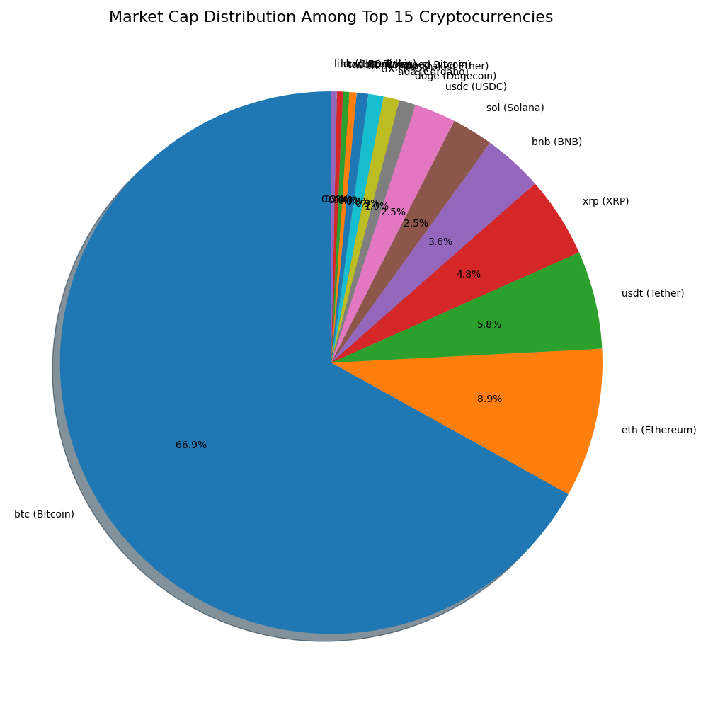
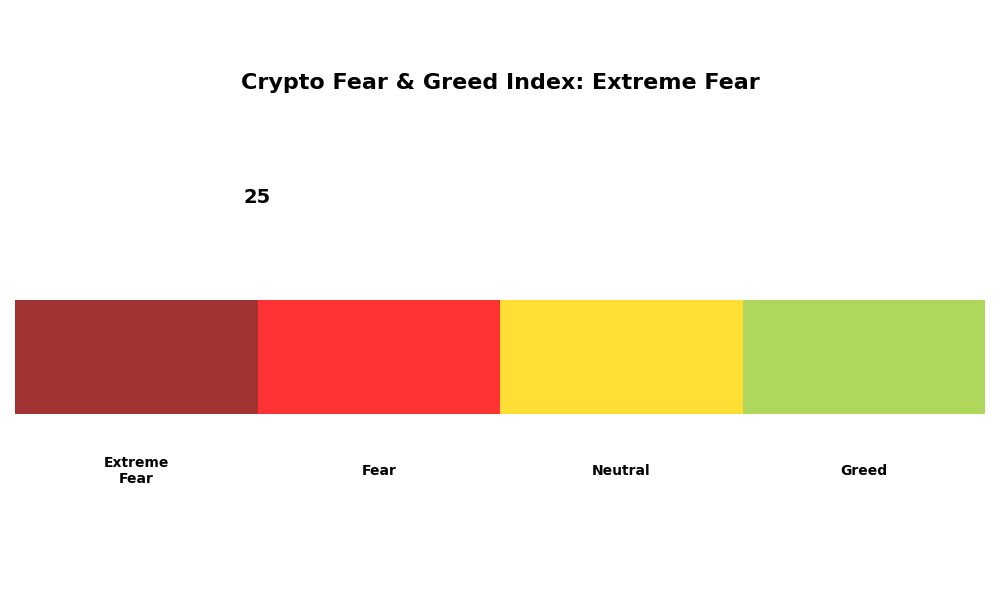
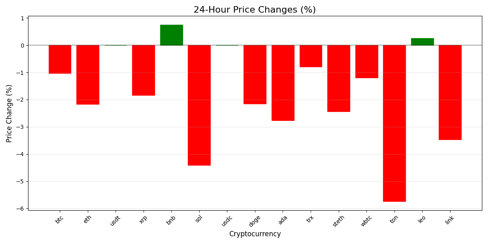

# Cryptocurrency Market Report - Today

## Market Overview
- **Global Crypto Market Cap**: $2.65 Trillion (↓ 1.08% in the last 24 hours)
- **Total Crypto Market Volume (24h)**: $90.1 Billion (↓ 30.55%)
- **DeFi Volume**: $6.04 Billion (6.70% of total market volume)
- **Stablecoin Volume**: $86.19 Billion (95.66% of total market volume)
- **Bitcoin Dominance**: 62.01% (↑ 0.14%)
- **Market Sentiment**: Fear (25/100 on Fear & Greed Index)

### Market Cap Distribution

### Fear & Greed Index

## Top Cryptocurrencies

| # | Name | Price (USD) | 24h % | 7d % | Market Cap |
|---|------|------------|-------|------|------------|
| 1 | Bitcoin (BTC) | $82,795.77 | ↓ 0.89% | ↑ 4.70% | $1.64T |
| 2 | Ethereum (ETH) | $1,784.94 | ↓ 2.17% | ↓ 10.85% | $215.29B |
| 3 | Tether (USDT) | $0.9997 | ↓ 0.03% | ↓ 0.04% | $144.04B |
| 4 | XRP (XRP) | $2.05 | ↓ 0.08% | ↑ 11.20% | $119.76B |
| 5 | BNB (BNB) | $592.24 | ↓ 1.68% | ↑ 6.44% | $84.38B |
| 6 | USD Coin (USDC) | $0.9999 | ↓ 0.00% | ↑ 0.01% | $60.88B |
| 7 | Solana (SOL) | $115.47 | ↓ 4.11% | ↓ 16.15% | $59.40B |
| 8 | Dogecoin (DOGE) | $0.1617 | ↓ 2.48% | ↑ 14.97% | $24.06B |
| 9 | Cardano (ADA) | $0.6488 | ↓ 0.77% | ↑ 11.73% | $22.88B |
| 10 | TRON (TRX) | $0.2392 | ↓ 1.16% | ↑ 2.98% | $22.72B |

## Trending Coins
1. MONKY - Up 6.65%
2. MIU - Up 280.78%
3. Digibyte (DGB) - Up 11.14%
4. FunToken (FUN) - Up 44.42%
5. Cosmos (ATOM) - Up 7.64%

## Market Insights
- The global crypto market is experiencing a slight downturn with a 1.08% decrease in the last 24 hours
- Bitcoin continues to maintain strong dominance at 62.01%
- Trading volume has decreased significantly (30.55%) in the past 24 hours
- Market sentiment is in the "Fear" zone at 25/100, indicating cautious investor behavior
- Several altcoins are showing significant weekly gains despite the overall market decline

## Notable Movements
- XRP showing strong weekly performance (↑ 11.20%)
- Solana experiencing significant weekly decline (↓ 16.15%)
- Dogecoin showing strong recovery (↑ 14.97% weekly)
- Cardano performing well this week (↑ 11.73%)
- Ethereum showing weakness with a 10.85% weekly decline

### 24-Hour Price Changes

## Additional Information

### Bitcoin ETFs
- Bitcoin ETFs continue to attract significant institutional investment
- The approval of spot Bitcoin ETFs in January 2024 has provided a regulated avenue for traditional investors to gain exposure to Bitcoin
- This institutional adoption has contributed to Bitcoin's strong market dominance

### Market Sentiment Analysis
- The current Fear & Greed Index reading of 25 indicates a "Fear" sentiment in the market
- This typically suggests that the market may be undervalued from a contrarian perspective
- Historical patterns show that extreme fear often precedes market recoveries

### Upcoming Events to Watch
- Potential regulatory developments in major markets
- Bitcoin halving effects continuing to impact market dynamics
- Ethereum's ongoing development and scaling solutions
- Central Bank Digital Currency (CBDC) developments and their impact on the crypto ecosystem

*Data sourced from CoinMarketCap as of today*