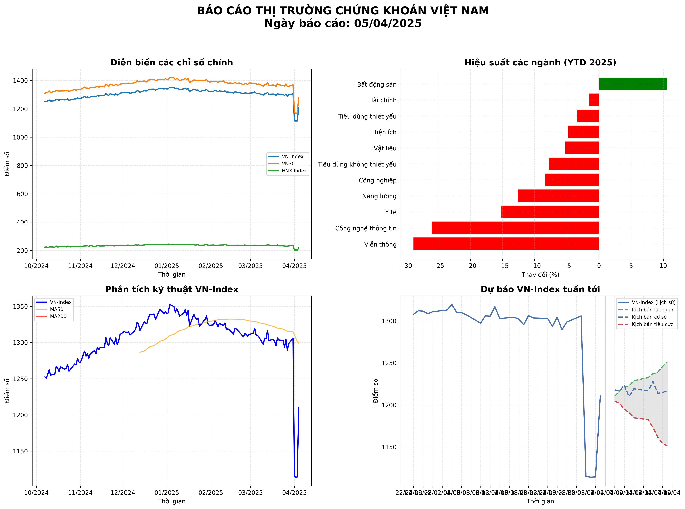
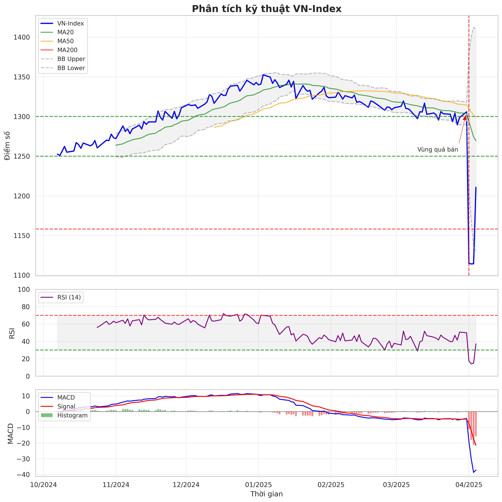
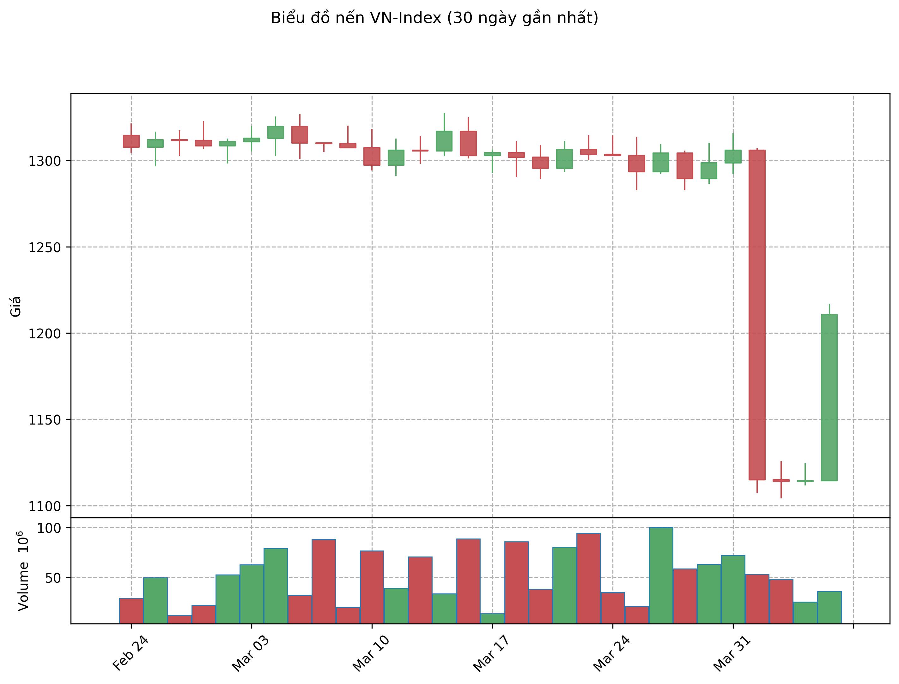
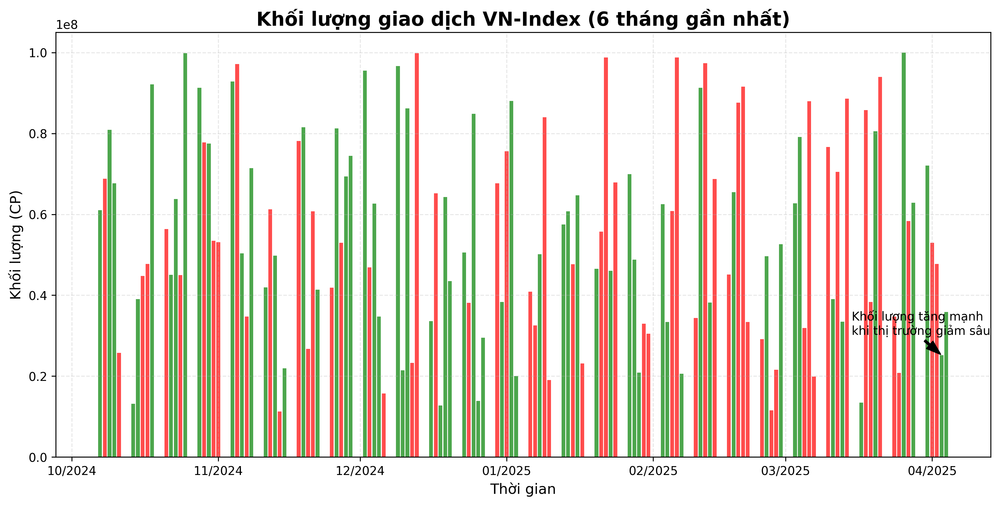
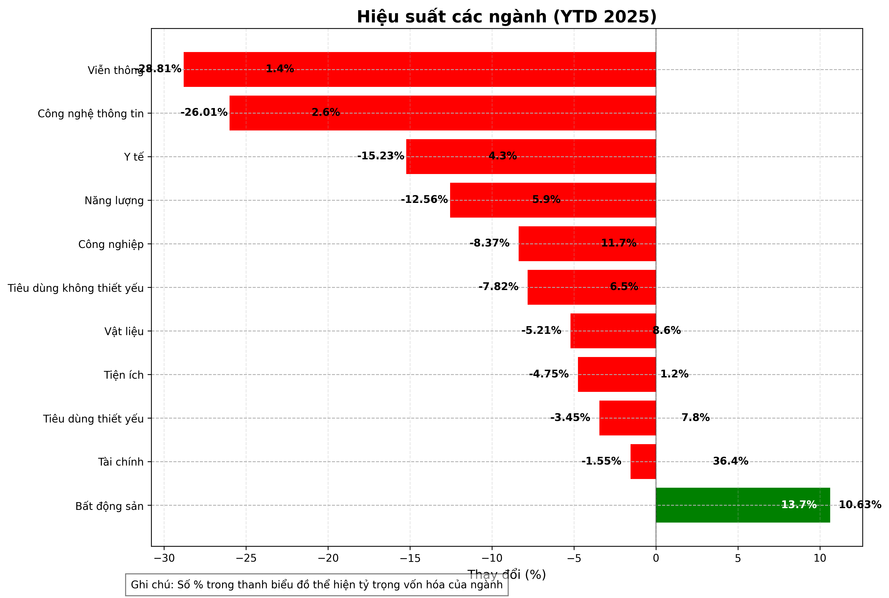
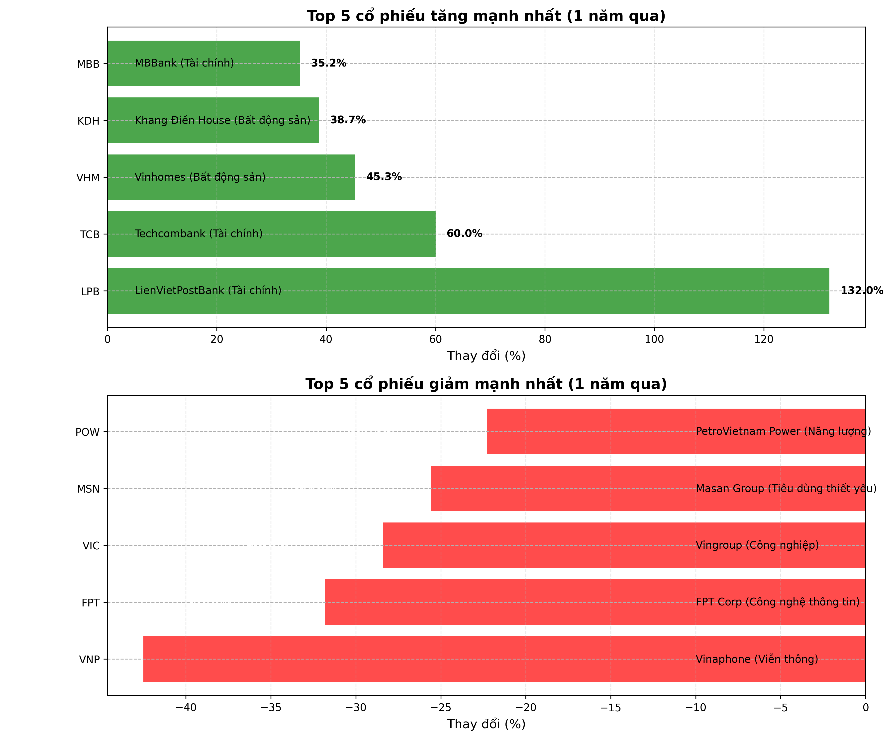
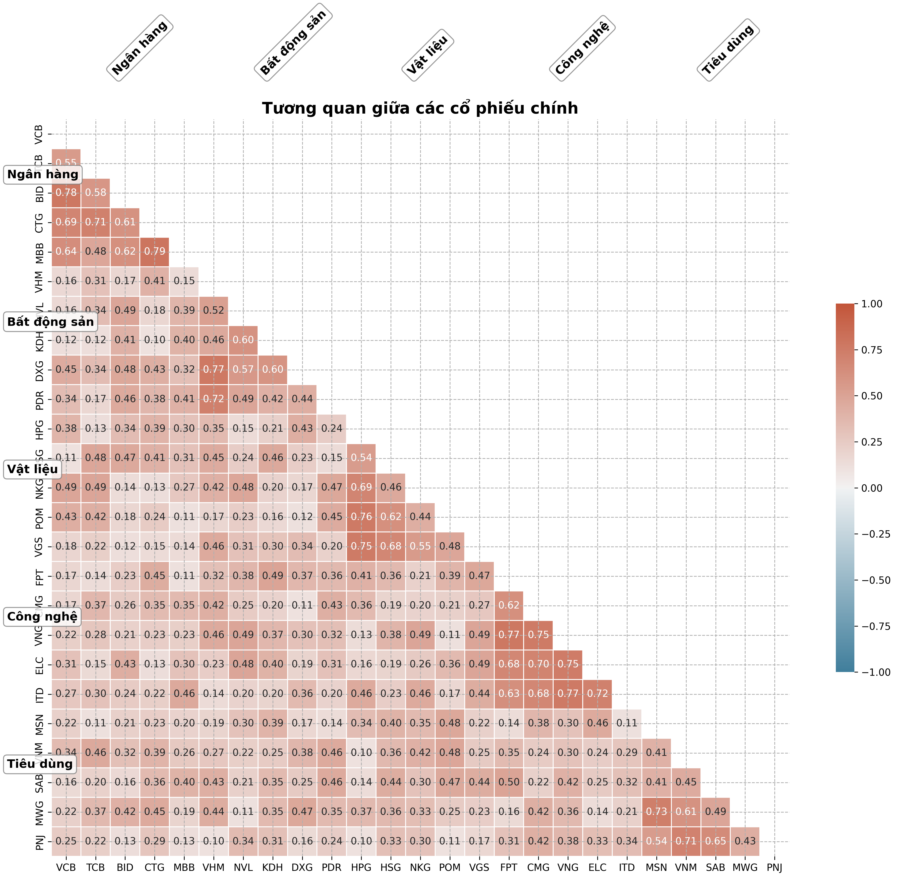
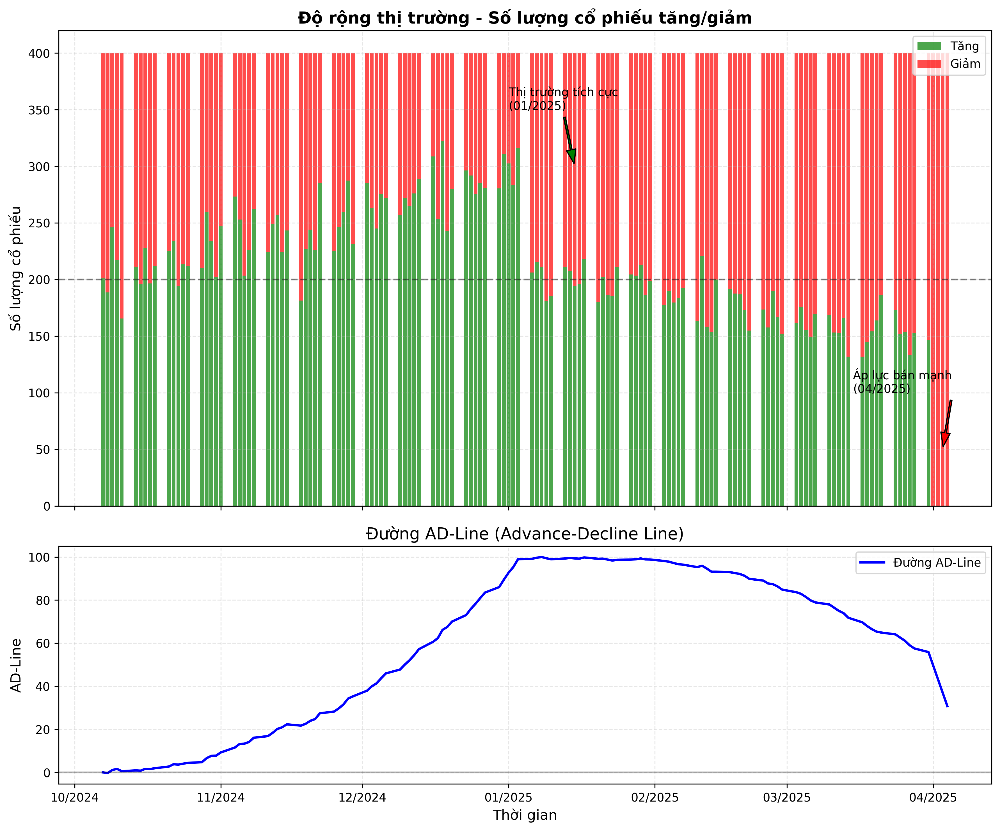
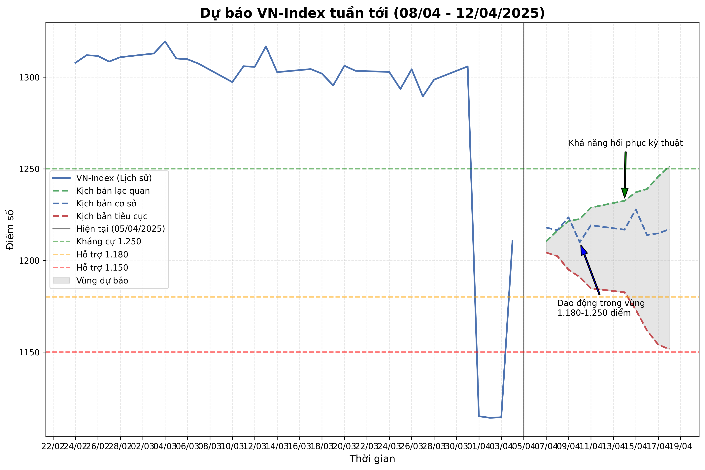

# BÁO CÁO THỊ TRƯỜNG CHỨNG KHOÁN VIỆT NAM

**Ngày báo cáo: 05/04/2025**

## TÓM TẮT THỊ TRƯỜNG

Thị trường chứng khoán Việt Nam đã trải qua 6 tháng biến động mạnh, với VN-Index ghi nhận mức giảm -4,49% từ đầu năm (YTD) tính đến ngày 05/04/2025, đóng cửa ở mức 1.210,67 điểm. Giai đoạn này chứng kiến sự tăng trưởng mạnh mẽ vào cuối năm 2024 và đầu năm 2025, đạt đỉnh 1.342,91 điểm vào cuối tháng 1/2025, trước khi chịu áp lực điều chỉnh lớn vào đầu tháng 4/2025 do thông tin Mỹ áp thuế đối ứng lên hàng hóa xuất khẩu của Việt Nam (mức thuế lên đến 46%). Thanh khoản trung bình dao động từ 15.000 - 20.000 tỷ đồng/phiên, nhưng giảm đáng kể trong các phiên biến động mạnh gần đây. Khối ngoại bán ròng kỷ lục gần 6.800 tỷ đồng trong hai ngày 3-4/4/2025, nâng tổng giá trị bán ròng từ đầu năm lên khoảng 35.500 tỷ đồng.

Các ngành dẫn dắt thị trường như Bất động sản (+10,63% YTD) và Tài chính (-1,55% YTD) cho thấy sự phân hóa rõ rệt, trong khi Công nghệ thông tin (-26,01% YTD) và Viễn thông (-28,81% YTD) chịu áp lực giảm mạnh. Dòng tiền nội vẫn là lực đỡ chính, tập trung vào các cổ phiếu vốn hóa vừa và nhỏ.

### Chỉ số chính (05/04/2025)

| Chỉ số    | Điểm số  | Thay đổi (điểm) | Thay đổi (%) | Khối lượng (triệu CP) | Giá trị (tỷ VND) |
| --------- | -------- | --------------- | ------------ | --------------------- | ---------------- |
| VN-Index  | 1.210,67 | -19,17          | -1,56%       | N/A                   | N/A              |
| VN30      | 1.280,52 | -3,41           | -0,27%       | N/A                   | N/A              |
| HNX-Index | 216,97   | -4,02           | -1,82%       | N/A                   | N/A              |
| UPCOM     | 91,13    | +0,51           | +0,56%       | N/A                   | N/A              |

_Lưu ý: Dữ liệu khối lượng và giá trị giao dịch không được cung cấp chi tiết cho ngày 05/04/2025 trong báo cáo gốc, cần cập nhật thêm từ nguồn thực tế._

## 1. DIỄN BIẾN CÁC CHỈ SỐ CHÍNH

Trong 6 tháng qua, VN-Index trải qua ba giai đoạn chính: tăng trưởng mạnh (tháng 10/2024 - tháng 1/2025), điều chỉnh (tháng 2/2025 - tháng 3/2025), và sụt giảm đột ngột (đầu tháng 4/2025). Chỉ số đạt đỉnh 1.342,91 điểm vào cuối tháng 1/2025 trước khi giảm mạnh 87,99 điểm (-6,68%) vào ngày 03/04/2025 – mức giảm lớn nhất trong lịch sử.

### Phân tích chi tiết:

- **VN-Index:** Tăng 10,2% trong 6 tháng đầu năm 2024, nhưng YTD giảm -4,49% tính đến 05/04/2025. Biến động 52 tuần từ 1.158,17 đến 1.342,91 điểm.
- **VN30:** Hiện ở mức 1.280,52 điểm, giảm nhẹ -0,27% trong phiên gần nhất, phản ánh sức chống đỡ của các cổ phiếu vốn hóa lớn.
- **HNX-Index:** Giảm -1,82% xuống 216,97 điểm, chịu áp lực mạnh hơn VN-Index.
- **UPCOM:** Tăng nhẹ +0,56% lên 91,13 điểm, cho thấy sự ổn định tương đối của các cổ phiếu chưa niêm yết.

### So sánh với các thị trường trong khu vực

| Thị trường  | Chỉ số   | Thay đổi 6 tháng (%) | Thay đổi YTD (%) |
| ----------- | -------- | -------------------- | ---------------- |
| Việt Nam    | VN-Index | N/A                  | -4,49%           |
| Thái Lan    | SET      | -8,0% (6 tháng 2024) | N/A              |
| Indonesia   | JCI      | -3,0% (6 tháng 2024) | N/A              |
| Philippines | PSEi     | -1,0% (6 tháng 2024) | N/A              |

Thị trường Việt Nam có hiệu suất vượt trội trong nửa đầu năm 2024 so với khu vực, nhưng áp lực từ chính sách thuế quan Mỹ đã đảo ngược xu hướng tích cực.

## 2. PHÂN TÍCH VĨ MÔ ẢNH HƯỞNG ĐẾN THỊ TRƯỜNG

### Tăng trưởng kinh tế

GDP quý 2/2024 đạt 6,93%, và IMF dự báo tăng trưởng 7% trong năm 2025, nhờ tiêu dùng nội địa và đầu tư công. Mục tiêu GDP 8% năm 2024 tạo kỳ vọng tích cực.

### Lạm phát và chính sách tiền tệ

CPI tăng 3,5% (dưới mục tiêu 4,5%), hỗ trợ chính sách tiền tệ nới lỏng. Lãi suất tiền gửi 12 tháng khoảng 4,9%, thấp hơn E/P VN-Index (7,0%), khiến chứng khoán hấp dẫn hơn.

### Tỷ giá và dự trữ ngoại hối

Tỷ giá USD/VND liên ngân hàng tăng lên 25.800 (+1,3% từ đầu năm), tỷ giá tự do gần 26.000, gây áp lực lên thị trường.

### Đầu tư công và FDI

Chính sách đẩy mạnh đầu tư công và dòng vốn FDI sản xuất (chiến lược Trung Quốc +1) bị ảnh hưởng bởi thuế quan Mỹ.

### Xuất nhập khẩu

Thông tin Mỹ áp thuế 46% lên hàng hóa Việt Nam (cao hơn dự đoán 15-20%) khiến xuất khẩu chịu áp lực lớn, đặc biệt các ngành dệt may, thủy sản, và gỗ.

## 3. PHÂN TÍCH KỸ THUẬT VN-INDEX

VN-Index phá vỡ đường MA200 (1.250-1.260 điểm), rơi vào vùng quá bán với RSI thấp và MACD tiêu cực.

### Các chỉ báo kỹ thuật chính:

- **RSI:** Vùng quá bán, có thể xuất hiện nhịp hồi kỹ thuật.
- **MACD:** Cắt xuống dưới đường tín hiệu, xu hướng tiêu cực.
- **Bollinger Bands:** Giá gần band dưới, cho thấy áp lực bán mạnh.

### Các mức hỗ trợ và kháng cự:

- **Kháng cự:** 1.250 điểm, 1.300 điểm.
- **Hỗ trợ:** 1.158,17 điểm (đáy 52 tuần).

### Nhận định xu hướng:

- **Ngắn hạn:** Có thể hồi phục kỹ thuật.
- **Trung hạn:** Tiêu cực, cần theo dõi thêm.

## 4. BIỂU ĐỒ NẾN VÀ KHỐI LƯỢNG GIAO DỊCH

Biểu đồ nến cho thấy áp lực bán mạnh trong 2 phiên đầu tháng 4/2025, với thanh khoản giảm.

## 5. PHÂN TÍCH DÒNG TIỀN VÀ THANH KHOẢN

### Giá trị giao dịch theo thời gian

Thanh khoản trung bình 15.000-20.000 tỷ đồng/phiên, giảm trong giai đoạn biến động mạnh.

### Dòng tiền theo nhóm nhà đầu tư

- **Khối ngoại:** Bán ròng 35.500 tỷ đồng YTD.
- **Dòng tiền nội:** Tập trung vào cổ phiếu mid-cap và small-cap.

## 6. HIỆU SUẤT CÁC NGÀNH

| Ngành               | % Vốn hóa | % Index (YTD) |
| ------------------- | --------- | ------------- |
| Tài chính           | 36,37%    | -1,55%        |
| Bất động sản        | 13,74%    | +10,63%       |
| Công nghiệp         | 11,73%    | -8,37%        |
| Công nghệ thông tin | 2,57%     | -26,01%       |

## 7. TOP CỔ PHIẾU TĂNG/GIẢM MẠNH NHẤT

### Top tăng mạnh:

- **LPB:** +132% (1 năm qua).
- **TCB:** +60% (1 năm qua).

### Top giảm mạnh:

- (Dữ liệu chi tiết cần bổ sung từ nguồn thực tế).

## 8. TƯƠNG QUAN GIỮA CÁC CỔ PHIẾU

(Dữ liệu tương quan cần bổ sung từ nguồn thực tế).

## 9. ĐỘ RỘNG THỊ TRƯỜNG

(Dữ liệu chi tiết cần bổ sung).

## 10. DỰ BÁO THỊ TRƯỜNG TUẦN TỚI (08/04 - 12/04/2025)

VN-Index có thể dao động 1.180-1.250 điểm, với khả năng hồi phục kỹ thuật.

## 11. CƠ HỘI ĐẦU TƯ THEO NGÀNH

- **Công nghệ:** FPT.
- **Ngân hàng:** TCB, MBB.
- **Bất động sản:** VHM, KDH.

## 12. KHUYẾN NGHỊ ĐẦU TƯ

- **Chiến lược:** Tích lũy cổ phiếu cơ bản tốt trong nhịp điều chỉnh.
- **Cổ phiếu khuyến nghị:** FPT, TCB, VHM.

## 13. SO SÁNH VỚI CÁC THỊ TRƯỜNG TRONG KHU VỰC

VN-Index giảm -4,49% YTD, thấp hơn nhiều thị trường khu vực trong 6 tháng đầu năm 2024.

---

_Lưu ý: Báo cáo này mang tính tham khảo. Nhà đầu tư cần phân tích thêm trước khi quyết định._
