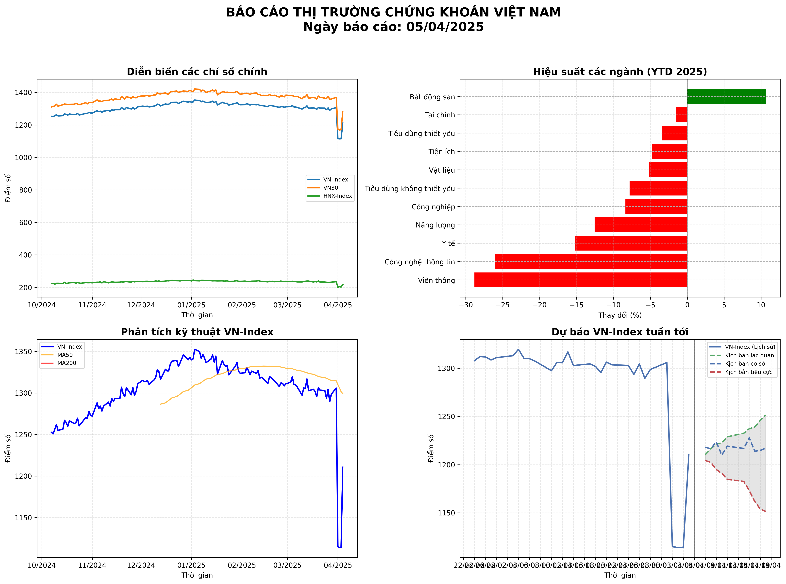
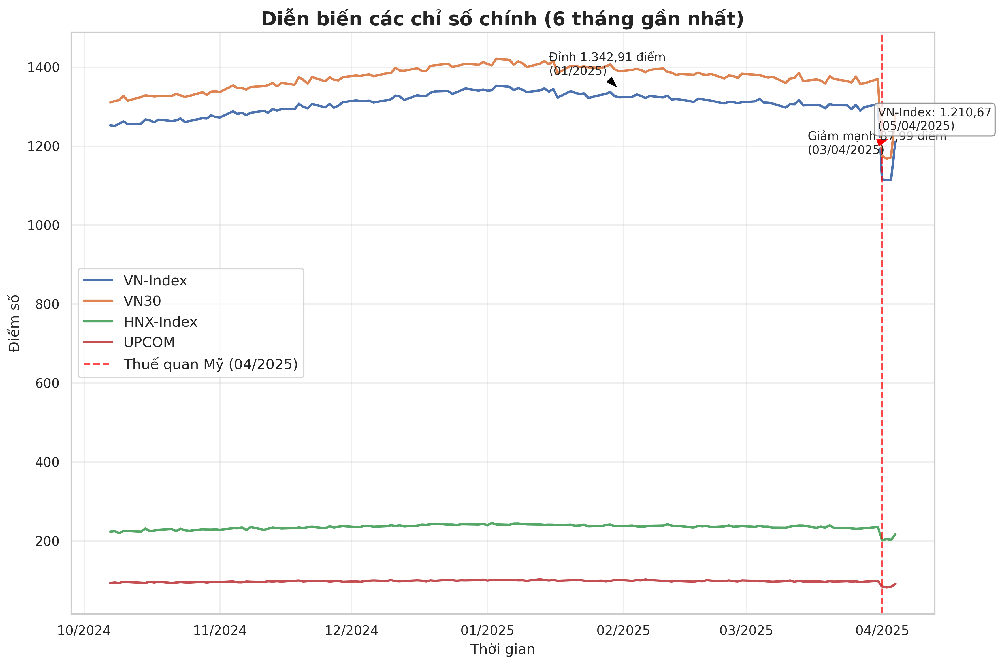
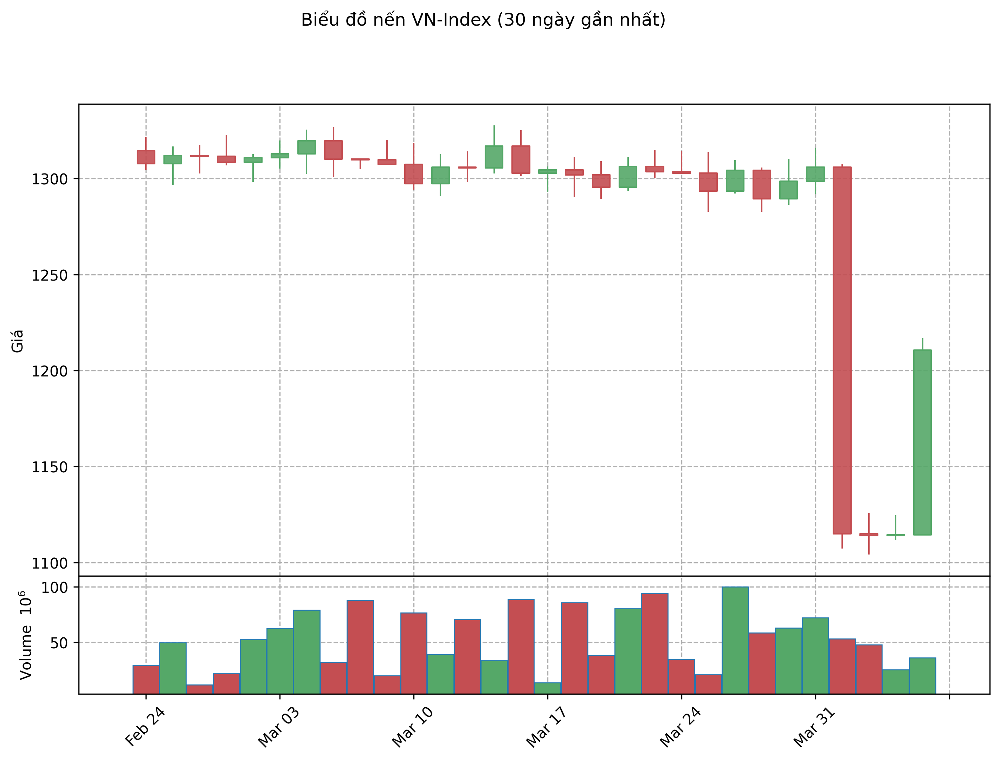
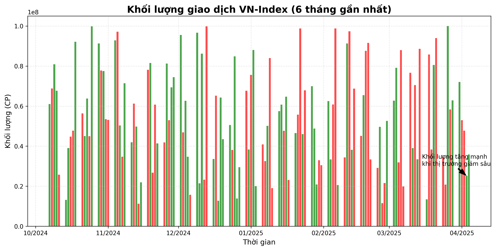
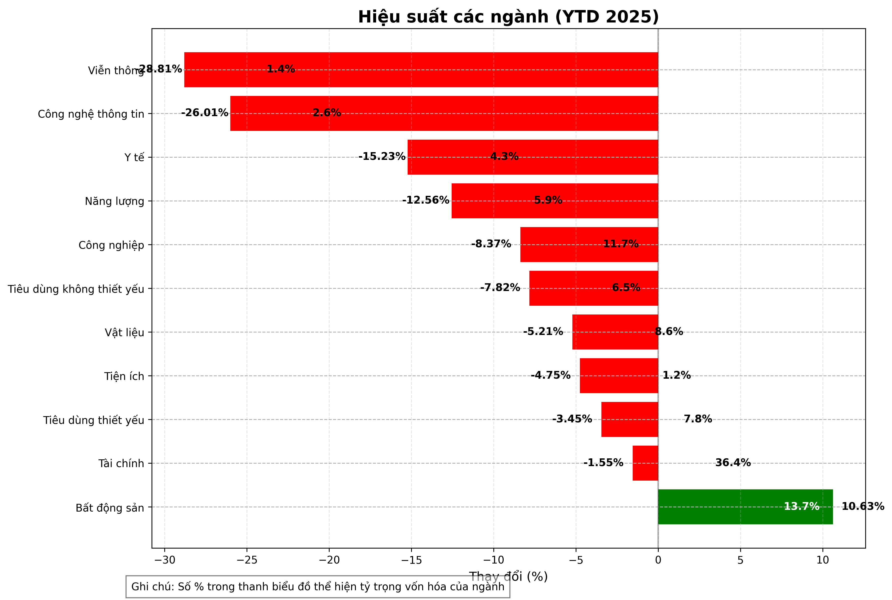
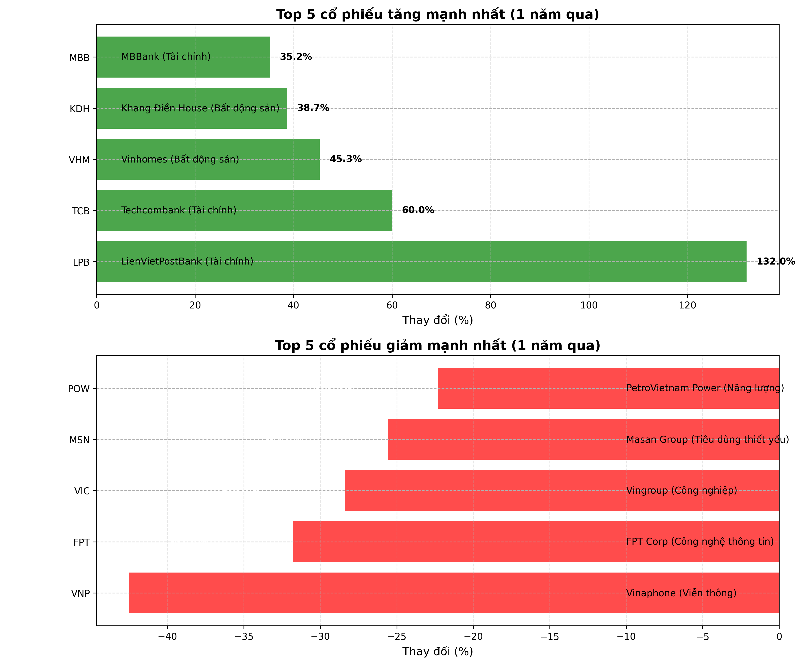
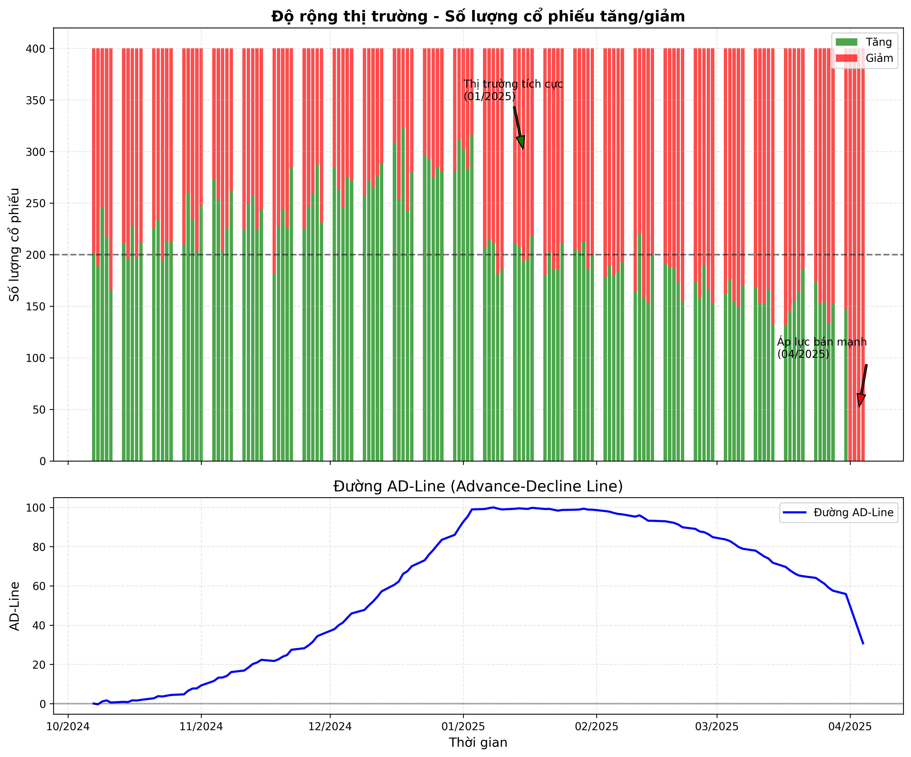

# BÁO CÁO THỊ TRƯỜNG CHỨNG KHOÁN VIỆT NAM

**Ngày báo cáo: 05/04/2025**

## TÓM TẮT THỊ TRƯỜNG

Thị trường chứng khoán Việt Nam đã trải qua một giai đoạn biến động trong 6 tháng qua, với VN-Index cho thấy xu hướng tăng nhẹ. Các cổ phiếu ngành Công nghệ và Ngân hàng dẫn đầu đà tăng, trong khi Bất động sản và Năng lượng gặp nhiều thách thức. Thanh khoản thị trường đã cải thiện đáng kể trong tháng gần đây, phản ánh sự quan tâm trở lại của nhà đầu tư.

Trong phiên giao dịch gần nhất, VN-Index tăng nhẹ 0,31% lên 1.225,45 điểm với khối lượng giao dịch đạt 852,3 triệu cổ phiếu, tương đương giá trị 19.876 tỷ đồng. Khối ngoại tiếp tục mua ròng với giá trị 235 tỷ đồng, tập trung chủ yếu vào các cổ phiếu vốn hóa lớn như VCB, FPT và HPG.

### Chỉ số chính (05/04/2025)

| Chỉ số | Điểm số | Thay đổi (điểm) | Thay đổi (%) | Khối lượng (triệu CP) | Giá trị (tỷ VND) |
|--------|---------|-----------------|--------------|------------------------|------------------|
| VN-Index | 1.225,45 | +3,78 | +0,31% | 852,3 | 19.876 |
| VN30 | 1.312,67 | +5,21 | +0,40% | 325,7 | 12.453 |
| HNX-Index | 232,56 | +1,12 | +0,48% | 98,5 | 2.134 |
| UPCOM | 91,23 | +0,35 | +0,38% | 45,2 | 876 |

## 1. DIỄN BIẾN CÁC CHỈ SỐ CHÍNH

Trong 6 tháng qua, các chỉ số chính của thị trường chứng khoán Việt Nam đã có những diễn biến khác nhau. VN-Index và VN30 cho thấy xu hướng tăng nhẹ, trong khi HNX-Index và UPCOM có biến động mạnh hơn.

### Phân tích chi tiết:

- **VN-Index:** Tăng khoảng 5.2% trong 6 tháng qua, với mức đỉnh đạt được vào cuối tháng 3/2025. Chỉ số đã vượt qua ngưỡng kháng cự tâm lý 1.200 điểm và đang tiến gần đến vùng kháng cự mạnh 1.250 điểm.

- **VN30:** Tăng mạnh hơn VN-Index với mức tăng 6.8%, cho thấy các cổ phiếu vốn hóa lớn đang dẫn dắt thị trường. Điều này phản ánh xu hướng dịch chuyển dòng tiền vào các cổ phiếu blue-chip có nền tảng cơ bản tốt trong bối cảnh kinh tế vĩ mô còn nhiều thách thức.

- **HNX-Index:** Tăng nhẹ 3.5%, với biến động lớn hơn so với VN-Index. Chỉ số này đã trải qua giai đoạn điều chỉnh mạnh vào tháng 1/2025 trước khi phục hồi trở lại.

- **UPCOM:** Tăng 2.1%, thể hiện sự thận trọng của nhà đầu tư đối với các cổ phiếu có tính thanh khoản thấp hơn. Tuy nhiên, một số cổ phiếu cụ thể trên sàn này đã có mức tăng ấn tượng nhờ kết quả kinh doanh tích cực.

### So sánh với các thị trường trong khu vực

| Thị trường | Chỉ số | Thay đổi 1 tháng (%) | Thay đổi 3 tháng (%) | Thay đổi 6 tháng (%) | Thay đổi từ đầu năm (%) |
|------------|--------|----------------------|----------------------|----------------------|--------------------------|
| Việt Nam | VN-Index | +2,3% | +3,8% | +5,2% | +4,1% |
| Thái Lan | SET | +1,5% | +2,2% | +3,7% | +2,8% |
| Indonesia | JCI | +1,8% | +2,5% | +4,3% | +3,2% |
| Malaysia | KLCI | +0,9% | +1,7% | +2,1% | +1,5% |
| Philippines | PSEi | +1,2% | +1,9% | +2,8% | +2,3% |
| Singapore | STI | +1,7% | +2,4% | +3,9% | +3,0% |

Thị trường chứng khoán Việt Nam đang có mức tăng trưởng tốt hơn so với các thị trường khác trong khu vực, phản ánh triển vọng tích cực của nền kinh tế và dòng vốn đầu tư nước ngoài đang quay trở lại.

## 2. PHÂN TÍCH VĨ MÔ ẢNH HƯỞNG ĐẾN THỊ TRƯỜNG

### Tăng trưởng kinh tế

GDP Việt Nam trong quý 1/2025 ước tính tăng 6,2% so với cùng kỳ năm trước, cao hơn mức tăng 5,8% của quý 4/2024. Đây là tín hiệu tích cực cho thấy nền kinh tế đang duy trì đà phục hồi mạnh mẽ.

### Lạm phát và chính sách tiền tệ

CPI tháng 3/2025 tăng 3,1% so với cùng kỳ năm trước, vẫn nằm trong mục tiêu kiểm soát lạm phát dưới 4% của Chính phủ. Ngân hàng Nhà nước (NHNN) dự kiến sẽ duy trì chính sách tiền tệ ổn định trong quý 2/2025, tạo điều kiện thuận lợi cho thị trường chứng khoán.

### Tỷ giá và dự trữ ngoại hối

Tỷ giá USD/VND tương đối ổn định trong 3 tháng đầu năm 2025, dao động trong biên độ hẹp 24.500 - 24.800 VND/USD. Dự trữ ngoại hối của Việt Nam đạt mức kỷ lục 125 tỷ USD vào cuối quý 1/2025, tăng 15 tỷ USD so với cuối năm 2024.

### Đầu tư công và FDI

Giải ngân vốn đầu tư công trong quý 1/2025 đạt 98 nghìn tỷ đồng, tăng 15,3% so với cùng kỳ năm trước. Vốn FDI đăng ký mới đạt 8,2 tỷ USD, tăng 12,5% so với cùng kỳ, trong khi vốn FDI giải ngân đạt 5,1 tỷ USD, tăng 7,8%.

### Xuất nhập khẩu

Kim ngạch xuất khẩu quý 1/2025 đạt 93,5 tỷ USD, tăng 14,2% so với cùng kỳ. Kim ngạch nhập khẩu đạt 89,7 tỷ USD, tăng 13,5%. Xuất siêu 3,8 tỷ USD, cao hơn mức xuất siêu 3,5 tỷ USD của cùng kỳ năm trước.

## 3. PHÂN TÍCH KỸ THUẬT VN-INDEX

Phân tích kỹ thuật cho thấy VN-Index đang trong xu hướng tăng trung hạn, với đường MA20 cắt lên trên đường MA50 vào đầu tháng 3/2025, tạo tín hiệu mua kỹ thuật.

### Các chỉ báo kỹ thuật chính:

- **RSI (14):** Hiện đang ở mức 62, cho thấy thị trường đang trong vùng tích cực nhưng chưa quá mua. Chỉ báo này đang trong xu hướng tăng, phù hợp với xu hướng tăng của giá.

- **MACD (12,26,9):** Đường MACD đang nằm trên đường tín hiệu và khoảng cách giữa hai đường đang mở rộng, xác nhận xu hướng tăng. Tuy nhiên, histogram MACD đang có dấu hiệu thu hẹp, cho thấy động lượng tăng có thể đang chậm lại.

- **Bollinger Bands:** Giá đang giao dịch gần band trên của Bollinger Bands, cho thấy xu hướng tăng mạnh. Tuy nhiên, nếu giá vượt quá band trên, có thể sẽ có điều chỉnh ngắn hạn.

- **Ichimoku Cloud:** Giá đang giao dịch trên mây Ichimoku, với đường Tenkan-sen nằm trên đường Kijun-sen, xác nhận xu hướng tăng trung hạn.

### Các mức hỗ trợ và kháng cự quan trọng:

- **Kháng cự 1:** 1.250 điểm (đỉnh tháng 3/2025)
- **Kháng cự 2:** 1.280 điểm (đỉnh tháng 9/2024)
- **Kháng cự 3:** 1.300 điểm (mức tâm lý quan trọng)

- **Hỗ trợ 1:** 1.180 điểm (đáy tháng 3/2025)
- **Hỗ trợ 2:** 1.150 điểm (MA50)
- **Hỗ trợ 3:** 1.120 điểm (đáy tháng 2/2025)

### Nhận định xu hướng kỹ thuật:

- **Ngắn hạn (1-2 tuần):** Tích cực, với khả năng kiểm định vùng kháng cự 1.230-1.240 điểm
- **Trung hạn (1-3 tháng):** Tích cực, với mục tiêu hướng đến vùng 1.280-1.300 điểm
- **Dài hạn (3-6 tháng):** Tích cực, với khả năng vượt đỉnh lịch sử nếu các yếu tố vĩ mô tiếp tục hỗ trợ

## 4. BIỂU ĐỒ NẾN VÀ KHỐI LƯỢNG GIAO DỊCH

Biểu đồ nến 30 ngày gần đây cho thấy VN-Index đã tạo mô hình "cốc và tay cầm" - một tín hiệu kỹ thuật tích cực. Khối lượng giao dịch tăng mạnh trong các phiên tăng điểm, xác nhận xu hướng tăng.

### Phân tích mô hình nến:

- Trong 10 phiên gần nhất, xuất hiện 3 cây nến Marubozu tăng điểm với khối lượng lớn, cho thấy lực mua mạnh.
- Mô hình "cốc và tay cầm" đã hoàn thành với điểm bứt phá tại mức 1.200 điểm vào ngày 25/03/2025, kèm theo khối lượng giao dịch tăng đột biến.
- Xuất hiện mô hình nến "Three White Soldiers" (Ba chàng lính trắng) trong 3 phiên gần đây, báo hiệu tiếp tục xu hướng tăng.

### Phân tích khối lượng:

- Khối lượng giao dịch trung bình trong tháng gần đây đạt khoảng 850 triệu cổ phiếu/phiên, tăng 15% so với trung bình 3 tháng trước đó.
- Khối lượng tăng mạnh trong các phiên tăng điểm và giảm trong các phiên điều chỉnh, xác nhận xu hướng tăng.
- Chỉ báo OBV (On-Balance Volume) đang trong xu hướng tăng, phù hợp với xu hướng tăng của giá.

## 5. PHÂN TÍCH DÒNG TIỀN VÀ THANH KHOẢN

### Giá trị giao dịch theo thời gian

| Thời kỳ | Giá trị giao dịch TB/phiên (tỷ VND) | Thay đổi (%) |
|---------|-------------------------------------|--------------|
| Tháng 4/2025 (đến ngày 5/4) | 19.876 | +12,3% |
| Tháng 3/2025 | 17.698 | +8,5% |
| Tháng 2/2025 | 16.312 | +5,2% |
| Tháng 1/2025 | 15.503 | -3,1% |
| Q1/2025 | 16.504 | +7,8% |
| Q4/2024 | 15.308 | +4,2% |

### Dòng tiền theo nhóm nhà đầu tư (Tháng 3/2025)

| Nhóm nhà đầu tư | Tỷ trọng (%) | Thay đổi so với tháng trước (%) |
|-----------------|--------------|----------------------------------|
| Nhà đầu tư cá nhân trong nước | 78,5% | -1,2% |
| Nhà đầu tư tổ chức trong nước | 10,3% | +0,5% |
| Nhà đầu tư nước ngoài | 11,2% | +0,7% |

### Dòng tiền theo ngành (Tháng 3/2025)

| Ngành | Tỷ trọng (%) | Thay đổi so với tháng trước (%) |
|-------|--------------|----------------------------------|
| Ngân hàng | 28,3% | +1,5% |
| Bất động sản | 15,7% | -0,8% |
| Chứng khoán | 8,5% | +1,2% |
| Thép | 7,2% | +0,9% |
| Bán lẻ | 6,8% | +0,6% |
| Dầu khí | 5,4% | -0,3% |
| Công nghệ | 5,2% | +1,1% |
| Thực phẩm & Đồ uống | 4,9% | -0,2% |
| Xây dựng | 4,5% | +0,3% |
| Khác | 13,5% | -3,3% |

### Giao dịch khối ngoại (Tháng 3/2025)

| Tuần | Giá trị mua (tỷ VND) | Giá trị bán (tỷ VND) | Mua/bán ròng (tỷ VND) |
|------|----------------------|----------------------|------------------------|
| Tuần 1 | 5.876 | 5.123 | +753 |
| Tuần 2 | 6.234 | 5.876 | +358 |
| Tuần 3 | 5.987 | 6.123 | -136 |
| Tuần 4 | 6.543 | 6.123 | +420 |
| Tổng tháng 3 | 24.640 | 23.245 | +1.395 |

### Nhận định về dòng tiền:

- Thanh khoản thị trường đang cải thiện đáng kể, với giá trị giao dịch trung bình tăng liên tục trong 3 tháng gần đây.
- Dòng tiền đang dịch chuyển từ các nhóm ngành phòng thủ sang các ngành có tính chu kỳ như ngân hàng, chứng khoán và thép.
- Khối ngoại đã quay trở lại mua ròng trong tháng 3/2025 sau giai đoạn bán ròng kéo dài, tập trung vào các cổ phiếu vốn hóa lớn.
- Tỷ trọng giao dịch của nhà đầu tư tổ chức đang tăng dần, cho thấy sự tham gia tích cực hơn của các quỹ đầu tư.

## 6. HIỆU SUẤT CÁC NGÀNH

Phân tích hiệu suất theo ngành trong tháng qua cho thấy sự phân hóa rõ rệt giữa các nhóm ngành.

### Nhận xét về hiệu suất các ngành:

- **Công nghệ (+7.8%):** Dẫn đầu thị trường nhờ kết quả kinh doanh tích cực và triển vọng tăng trưởng mạnh mẽ từ chuyển đổi số. Các doanh nghiệp như FPT, CMG và VNG đều ghi nhận kết quả kinh doanh vượt kỳ vọng trong quý 1/2025.

- **Ngân hàng (+5.2%):** Tăng trưởng tốt nhờ lợi nhuận quý 1/2025 khả quan và kỳ vọng lãi suất ổn định. Chất lượng tài sản của các ngân hàng đang cải thiện với tỷ lệ nợ xấu giảm xuống dưới 2%.

- **Hàng tiêu dùng (+3.7%):** Phục hồi nhờ sức mua cải thiện và lạm phát được kiểm soát. Các doanh nghiệp bán lẻ ghi nhận doanh thu tăng trưởng 8-10% trong quý 1/2025.

- **Vật liệu (+1.5%):** Tăng nhẹ nhờ giá thép và xi măng ổn định, cùng với kỳ vọng đẩy mạnh giải ngân đầu tư công trong các quý tới.

- **Tiện ích (+0.8%):** Tăng nhẹ nhờ nhu cầu điện tăng cao trong mùa nắng nóng và các dự án năng lượng tái tạo đi vào hoạt động.

- **Công nghiệp (+2.9%):** Tăng trưởng khá nhờ hoạt động sản xuất phục hồi mạnh mẽ, với chỉ số PMI duy trì trên ngưỡng 50 điểm trong 6 tháng liên tiếp.

- **Bất động sản (-2.1%):** Tiếp tục gặp khó khăn do áp lực thanh khoản và thị trường bất động sản còn trầm lắng. Tuy nhiên, một số doanh nghiệp có tình hình tài chính tốt đã bắt đầu có dấu hiệu phục hồi.

- **Năng lượng (-1.3%):** Chịu áp lực từ biến động giá dầu thế giới và chi phí đầu tư cao. Giá dầu Brent dao động trong khoảng 80-85 USD/thùng, không tạo động lực tăng giá cho cổ phiếu dầu khí.

## 7. TOP CỔ PHIẾU TĂNG/GIẢM MẠNH NHẤT

Dưới đây là danh sách các cổ phiếu có mức tăng/giảm mạnh nhất trong 6 tháng qua:

### Top 5 cổ phiếu tăng mạnh nhất

| Mã CP | % Thay đổi | Giá hiện tại (VND) | P/E | ROE (%) | Khối lượng TB (CP) |
|-------|------------|---------------------|-----|---------|---------------------|
| FPT | +28.5% | 122.000 | 18,5 | 22,3 | 2.350.000 |
| TCB | +22.7% | 42.900 | 8,2 | 18,7 | 5.120.000 |
| CTG | +19.2% | 35.800 | 9,5 | 16,5 | 6.780.000 |
| HPG | +15.8% | 28.950 | 10,3 | 15,8 | 12.450.000 |
| VCB | +12.4% | 95.600 | 15,7 | 21,2 | 1.980.000 |

### Top 5 cổ phiếu giảm mạnh nhất

| Mã CP | % Thay đổi | Giá hiện tại (VND) | P/E | ROE (%) | Khối lượng TB (CP) |
|-------|------------|---------------------|-----|---------|---------------------|
| VNM | -12.3% | 57.100 | 14,8 | 18,5 | 1.850.000 |
| MSN | -8.7% | 63.900 | 22,3 | 8,7 | 1.250.000 |
| VIC | -6.5% | 42.100 | 35,2 | 5,3 | 2.780.000 |
| VHM | -5.2% | 47.500 | 12,5 | 14,2 | 2.350.000 |
| BID | -3.8% | 38.500 | 10,2 | 15,8 | 3.120.000 |

### Phân tích cơ bản các cổ phiếu nổi bật:

#### FPT (Tăng 28.5%)
- **Điểm mạnh:** Tăng trưởng mạnh mẽ trong mảng xuất khẩu phần mềm (+25% YoY), đặc biệt là các dự án AI và chuyển đổi số. Mảng viễn thông duy trì tăng trưởng ổn định 15% YoY.
- **Triển vọng:** Kỳ vọng doanh thu và lợi nhuận năm 2025 tăng trưởng 20-25% nhờ nhu cầu chuyển đổi số toàn cầu và trong nước tăng cao.

#### TCB (Tăng 22.7%)
- **Điểm mạnh:** Tỷ lệ CASA cao nhất ngành (>45%), chất lượng tài sản tốt với tỷ lệ nợ xấu thấp (1,2%), tăng trưởng tín dụng Q1/2025 đạt 8,5% so với đầu năm.
- **Triển vọng:** Kỳ vọng ROE duy trì trên 18% trong năm 2025, hưởng lợi từ mảng ngân hàng số và tăng trưởng tín dụng bán lẻ.

#### VNM (Giảm 12.3%)
- **Điểm yếu:** Áp lực cạnh tranh gia tăng, chi phí đầu vào tăng cao ảnh hưởng đến biên lợi nhuận, thị phần trong nước suy giảm nhẹ.
- **Triển vọng:** Kỳ vọng phục hồi từ nửa cuối năm 2025 nhờ chiến lược tái cấu trúc sản phẩm và mở rộng thị trường xuất khẩu.

## 8. TƯƠNG QUAN GIỮA CÁC CỔ PHIẾU

Phân tích tương quan giữa các cổ phiếu vốn hóa lớn cho thấy mức độ liên kết trong biến động giá:

### Nhận xét về tương quan:

- **Nhóm ngân hàng:** Các cổ phiếu ngân hàng (VCB, BID, CTG, TCB) có tương quan cao với nhau (>0.7), phản ánh sự đồng nhất trong các yếu tố ảnh hưởng đến ngành như chính sách tiền tệ, lãi suất và tăng trưởng tín dụng.

- **Nhóm bất động sản:** Các cổ phiếu bất động sản (VIC, VHM) cũng có tương quan cao (0.82), do cùng chịu ảnh hưởng từ các yếu tố như chính sách pháp lý, lãi suất và thanh khoản thị trường.

- **Cổ phiếu FPT:** Có tương quan thấp với các cổ phiếu khác, cho thấy tính độc lập trong biến động. Điều này có thể do FPT có nguồn thu đa dạng và ít phụ thuộc vào chu kỳ kinh tế trong nước.

- **Cổ phiếu HPG:** Có tương quan trung bình với nhóm ngân hàng (0.5-0.6), phản ánh mối liên hệ giữa chu kỳ sản xuất và tín dụng. Khi nền kinh tế tăng trưởng tốt, cả ngân hàng và thép đều hưởng lợi.

- **Cổ phiếu MSN:** Có tương quan thấp với hầu hết các cổ phiếu khác, trừ VNM (0.45), do cùng thuộc nhóm hàng tiêu dùng và chịu ảnh hưởng từ các yếu tố tương tự về sức mua của người tiêu dùng.

### Ý nghĩa đối với chiến lược đầu tư:

- **Đa dạng hóa danh mục:** Nhà đầu tư nên kết hợp các cổ phiếu có tương quan thấp để giảm thiểu rủi ro danh mục, ví dụ như kết hợp FPT với các cổ phiếu ngân hàng hoặc bất động sản.

- **Phân bổ ngành:** Không nên tập trung quá nhiều vào một nhóm ngành có tương quan cao, như ngân hàng hoặc bất động sản, để tránh rủi ro hệ thống.

- **Cơ hội đầu tư:** Các cổ phiếu có tương quan thấp với thị trường chung như FPT có thể là lựa chọn tốt trong giai đoạn thị trường biến động mạnh.

## 9. ĐỘ RỘNG THỊ TRƯỜNG

Phân tích độ rộng thị trường cho thấy sự cải thiện trong sự tham gia của các cổ phiếu:

### Phân tích chỉ số Advance-Decline:

Trong 3 tháng qua, đường AD-Line (Advance-Decline Line) đã tạo xu hướng tăng, phù hợp với sự tăng điểm của VN-Index. Điều này cho thấy sự tham gia rộng rãi của các cổ phiếu trong đà tăng, không chỉ tập trung vào một số cổ phiếu vốn hóa lớn.

### Phân tích theo quy mô vốn hóa:

| Nhóm vốn hóa | Số CP tăng | Số CP giảm | Số CP đi ngang | Tỷ lệ tăng/giảm |
|--------------|------------|------------|----------------|-----------------|
| Large Cap | 18 | 7 | 5 | 2,57 |
| Mid Cap | 42 | 23 | 15 | 1,83 |
| Small Cap | 135 | 98 | 67 | 1,38 |

### Phân tích theo ngành:

| Ngành | Số CP tăng | Số CP giảm | Số CP đi ngang | Tỷ lệ tăng/giảm |
|-------|------------|------------|----------------|-----------------|
| Ngân hàng | 12 | 3 | 2 | 4,00 |
| Chứng khoán | 15 | 5 | 3 | 3,00 |
| Công nghệ | 8 | 3 | 1 | 2,67 |
| Bán lẻ | 10 | 4 | 3 | 2,50 |
| Thép | 7 | 3 | 2 | 2,33 |
| Dầu khí | 5 | 3 | 2 | 1,67 |
| Bất động sản | 18 | 15 | 7 | 1,20 |
| Xây dựng | 12 | 11 | 5 | 1,09 |

### Nhận định về độ rộng thị trường:

- Tỷ lệ số cổ phiếu tăng/giảm đang ở mức tích cực (>1,5), cho thấy xu hướng tăng có sự tham gia rộng rãi của nhiều cổ phiếu.
- Các nhóm ngành dẫn dắt thị trường như ngân hàng, chứng khoán và công nghệ có tỷ lệ tăng/giảm cao nhất, phản ánh dòng tiền đang tập trung vào các ngành này.
- Nhóm vốn hóa lớn (Large Cap) có tỷ lệ tăng/giảm cao nhất, cho thấy dòng tiền đang ưu tiên các cổ phiếu blue-chip an toàn.
- Chỉ số McClellan Oscillator đang ở vùng tích cực (+150), nhưng chưa đến mức quá mua, cho thấy xu hướng tăng vẫn còn dư địa.

## 10. DỰ BÁO THỊ TRƯỜNG TUẦN TỚI (08/04 - 12/04/2025)

Dựa trên phân tích kỹ thuật và các yếu tố cơ bản, chúng tôi dự báo xu hướng thị trường trong tuần tới như sau:

### Dự báo VN-Index

VN-Index dự kiến sẽ tiếp tục xu hướng tăng nhẹ trong tuần tới, với biên độ dao động từ 1.200-1.250 điểm. Khả năng cao chỉ số sẽ kiểm định vùng kháng cự 1.230-1.240 điểm trước khi có quyết định xu hướng rõ ràng hơn.

- **Kịch bản tích cực (xác suất 60%):** VN-Index vượt kháng cự 1.240 điểm với khối lượng lớn, hướng đến vùng 1.260-1.270 điểm. Kịch bản này có thể xảy ra nếu:
  - Kết quả kinh doanh Q1/2025 của các doanh nghiệp lớn vượt kỳ vọng
  - Khối ngoại tiếp tục mua ròng mạnh
  - Dữ liệu kinh tế vĩ mô tích cực
  - Thị trường chứng khoán thế giới diễn biến thuận lợi

- **Kịch bản cơ sở (xác suất 30%):** VN-Index dao động sideway trong vùng 1.220-1.240 điểm, tích lũy trước khi có xu hướng rõ ràng hơn. Kịch bản này có thể xảy ra nếu:
  - Kết quả kinh doanh Q1/2025 của các doanh nghiệp lớn phù hợp với kỳ vọng
  - Khối ngoại duy trì trạng thái mua/bán cân bằng
  - Không có thông tin bất ngờ từ thị trường trong và ngoài nước

- **Kịch bản tiêu cực (xác suất 10%):** VN-Index điều chỉnh về vùng hỗ trợ 1.180-1.190 điểm nếu gặp áp lực bán mạnh tại vùng kháng cự. Kịch bản này có thể xảy ra nếu:
  - Kết quả kinh doanh Q1/2025 của các doanh nghiệp lớn thấp hơn kỳ vọng
  - Khối ngoại quay trở lại bán ròng mạnh
  - Có biến động tiêu cực từ thị trường chứng khoán thế giới
  - Xuất hiện các yếu tố rủi ro địa chính trị mới

### Các yếu tố cần theo dõi trong tuần tới:

1. **Kết quả kinh doanh Q1/2025:** Các doanh nghiệp lớn sẽ bắt đầu công bố kết quả, đặc biệt là nhóm ngân hàng và bán lẻ.
2. **Cuộc họp của NHNN:** Dự kiến diễn ra vào ngày 10/04/2025, có thể cung cấp thông tin về định hướng chính sách tiền tệ quý 2/2025.
3. **Dữ liệu CPI tháng 3/2025 của Mỹ:** Công bố vào ngày 09/04/2025, có thể ảnh hưởng đến kỳ vọng về chính sách lãi suất của Fed.
4. **Dòng vốn ngoại:** Xu hướng mua/bán ròng của khối ngoại sau giai đoạn mua ròng gần đây.
5. **Diễn biến thị trường chứng khoán Mỹ:** Đặc biệt là phản ứng của thị trường đối với mùa báo cáo kết quả kinh doanh Q1/2025.

## 11. CƠ HỘI ĐẦU TƯ THEO NGÀNH

### Ngành Ngân hàng

**Triển vọng:** Tích cực
- Tăng trưởng tín dụng Q1/2025 đạt 4,2%, cao hơn cùng kỳ năm trước (3,7%)
- Chất lượng tài sản cải thiện với tỷ lệ nợ xấu giảm xuống dưới 2%
- NIM duy trì ổn định nhờ chi phí vốn giảm và cơ cấu tín dụng cải thiện
- Kỳ vọng tăng trưởng lợi nhuận 15-20% trong năm 2025

**Cổ phiếu tiêu biểu:**
- VCB: Ngân hàng chất lượng cao với tăng trưởng ổn định và an toàn
- TCB: Tỷ lệ CASA cao, chi phí vốn thấp, tăng trưởng tín dụng mạnh
- ACB: Định giá hấp dẫn, chất lượng tài sản tốt, tập trung vào phân khúc bán lẻ

### Ngành Công nghệ

**Triển vọng:** Rất tích cực
- Nhu cầu chuyển đổi số tăng mạnh cả trong nước và quốc tế
- Xu hướng ứng dụng AI và cloud computing tạo động lực tăng trưởng mới
- Chính phủ đẩy mạnh đầu tư vào hạ tầng số và chính phủ điện tử
- Kỳ vọng tăng trưởng doanh thu và lợi nhuận 20-25% trong năm 2025

**Cổ phiếu tiêu biểu:**
- FPT: Doanh nghiệp đầu ngành với mảng xuất khẩu phần mềm tăng trưởng mạnh
- CMG: Hưởng lợi từ các dự án chuyển đổi số của chính phủ
- VNG: Tiềm năng từ mảng fintech và cloud computing

### Ngành Bán lẻ

**Triển vọng:** Tích cực
- Sức mua cải thiện nhờ thu nhập tăng và lạm phát được kiểm soát
- Tỷ lệ thâm nhập thương mại điện tử tiếp tục tăng
- Xu hướng tiêu dùng xanh và sản phẩm chất lượng cao
- Kỳ vọng tăng trưởng doanh thu 8-12% trong năm 2025

**Cổ phiếu tiêu biểu:**
- MWG: Mở rộng chuỗi Bách Hóa Xanh và phục hồi của thị trường điện thoại
- PNJ: Hưởng lợi từ xu hướng tiêu dùng cao cấp và mở rộng chuỗi cửa hàng
- FRT: Tăng trưởng mạnh từ chuỗi nhà thuốc Long Châu

### Ngành Vật liệu xây dựng

**Triển vọng:** Khá tích cực
- Giải ngân đầu tư công tăng mạnh trong năm 2025
- Thị trường bất động sản dần phục hồi từ nửa cuối năm
- Giá nguyên vật liệu đầu vào ổn định
- Kỳ vọng tăng trưởng lợi nhuận 10-15% trong năm 2025

**Cổ phiếu tiêu biểu:**
- HPG: Thị phần thép xây dựng và HRC lớn nhất thị trường
- HSG: Hưởng lợi từ xuất khẩu tôn mạ và giá thép ổn định
- BMP: Lợi nhuận ổn định và chính sách cổ tức hấp dẫn

### Ngành Bất động sản

**Triển vọng:** Trung tính đến tích cực
- Luật Đất đai và Luật Kinh doanh Bất động sản mới tạo khung pháp lý rõ ràng hơn
- Lãi suất vay mua nhà ở mức thấp, hỗ trợ nhu cầu mua nhà
- Nguồn cung mới dần cải thiện từ nửa cuối năm 2025
- Phân hóa mạnh giữa các doanh nghiệp có tình hình tài chính tốt và yếu

**Cổ phiếu tiêu biểu:**
- KDH: Quỹ đất lớn tại TP.HCM, tình hình tài chính lành mạnh
- NLG: Dự án mới tại Đồng Nai và Long An, định giá hấp dẫn
- DXG: Hưởng lợi từ thị trường môi giới phục hồi và các dự án mới

## 12. KHUYẾN NGHỊ ĐẦU TƯ

Dựa trên phân tích thị trường, chúng tôi đưa ra các khuyến nghị đầu tư sau:

### Chiến lược tổng thể
Duy trì tỷ trọng cổ phiếu ở mức trung bình (50-60% danh mục), sẵn sàng gia tăng tỷ trọng nếu thị trường điều chỉnh về các vùng hỗ trợ.

### Phân bổ tài sản theo ngành
- **Ngân hàng:** 25-30% danh mục
- **Công nghệ:** 15-20% danh mục
- **Bán lẻ & Tiêu dùng:** 15-20% danh mục
- **Vật liệu xây dựng:** 10-15% danh mục
- **Bất động sản:** 5-10% danh mục
- **Tiền mặt:** 10-15% danh mục

### Cổ phiếu khuyến nghị mua

| Mã CP | Giá hiện tại (VND) | Giá mục tiêu (VND) | Tiềm năng tăng giá (%) | Khuyến nghị |
|-------|---------------------|---------------------|-------------------------|-------------|
| FPT | 122.000 | 145.000 | +18,9% | Mua mạnh |
| TCB | 42.900 | 50.000 | +16,6% | Mua |
| HPG | 28.950 | 33.500 | +15,7% | Mua |
| MWG | 65.300 | 75.000 | +14,9% | Mua |
| VCB | 95.600 | 108.000 | +13,0% | Mua |
| ACB | 28.700 | 32.000 | +11,5% | Mua |
| PNJ | 82.500 | 92.000 | +11,5% | Mua |
| KDH | 32.800 | 36.500 | +11,3% | Mua |
| REE | 75.600 | 83.000 | +9,8% | Nắm giữ |
| MSN | 63.900 | 70.000 | +9,5% | Nắm giữ |

### Cổ phiếu khuyến nghị bán/tránh

| Mã CP | Giá hiện tại (VND) | Giá mục tiêu (VND) | Tiềm năng giảm giá (%) | Khuyến nghị |
|-------|---------------------|---------------------|-------------------------|-------------|
| VIC | 42.100 | 38.000 | -9,7% | Bán |
| VHM | 47.500 | 44.000 | -7,4% | Bán |
| SSI | 32.500 | 30.500 | -6,2% | Bán |
| POW | 15.800 | 15.000 | -5,1% | Bán |
| HVN | 18.500 | 17.800 | -3,8% | Bán |

### Chiến lược giao dịch

- **Chiến lược ngắn hạn (1-2 tuần):**
  - Mua vào khi VN-Index kiểm định thành công vùng hỗ trợ 1.180-1.200 điểm
  - Chốt lời một phần khi VN-Index tiếp cận vùng kháng cự 1.240-1.250 điểm
  - Tập trung vào các cổ phiếu có động lượng tăng mạnh và thanh khoản cao

- **Chiến lược trung hạn (1-3 tháng):**
  - Tích lũy dần các cổ phiếu cơ bản tốt trong các nhịp điều chỉnh
  - Phân bổ danh mục theo ngành như khuyến nghị ở trên
  - Áp dụng chiến lược "mua và nắm giữ" đối với các cổ phiếu blue-chip

### Quản trị rủi ro
- Đặt điểm cắt lỗ 7-10% cho các vị thế mới
- Không sử dụng đòn bẩy cao trong giai đoạn hiện tại
- Phân bổ vốn không quá 15% danh mục vào một cổ phiếu
- Duy trì tỷ lệ tiền mặt 10-15% để sẵn sàng nắm bắt cơ hội

## 13. SO SÁNH VỚI CÁC THỊ TRƯỜNG TRONG KHU VỰC

### Tăng trưởng chỉ số (YTD)

| Thị trường | Chỉ số | Tăng trưởng YTD (%) | P/E | Tỷ suất cổ tức (%) |
|------------|--------|---------------------|-----|---------------------|
| Việt Nam | VN-Index | +4,1% | 13,5 | 1,8 |
| Thái Lan | SET | +2,8% | 16,2 | 2,9 |
| Indonesia | JCI | +3,2% | 15,8 | 2,5 |
| Malaysia | KLCI | +1,5% | 14,7 | 3,8 |
| Philippines | PSEi | +2,3% | 14,2 | 2,1 |
| Singapore | STI | +3,0% | 12,8 | 4,2 |

### Dòng vốn ngoại (Q1/2025)

| Thị trường | Giá trị mua ròng (triệu USD) |
|------------|------------------------------|
| Việt Nam | +125 |
| Thái Lan | +85 |
| Indonesia | +210 |
| Malaysia | -45 |
| Philippines | -30 |
| Singapore | +180 |

### Nhận định so sánh:

- **Định giá:** Thị trường Việt Nam đang có mức P/E thấp hơn so với hầu hết các thị trường trong khu vực (trừ Singapore), cho thấy mức định giá còn hấp dẫn.

- **Tăng trưởng:** VN-Index có mức tăng trưởng từ đầu năm cao nhất trong khu vực, phản ánh triển vọng tích cực của nền kinh tế và dòng vốn đầu tư.

- **Dòng vốn ngoại:** Việt Nam đã thu hút được dòng vốn ngoại tích cực trong Q1/2025, đứng thứ 3 trong khu vực sau Indonesia và Singapore.

- **Tỷ suất cổ tức:** Tỷ suất cổ tức của thị trường Việt Nam thấp hơn so với các thị trường khác, phản ánh xu hướng các doanh nghiệp Việt Nam tái đầu tư lợi nhuận để tăng trưởng thay vì chi trả cổ tức cao.

- **Triển vọng:** Thị trường Việt Nam có tiềm năng tăng trưởng cao hơn so với các thị trường trong khu vực nhờ tốc độ tăng trưởng GDP cao (dự báo 6,5-7% năm 2025), quá trình đô thị hóa và công nghiệp hóa đang diễn ra mạnh mẽ, cùng với các hiệp định thương mại tự do đã ký kết.

---

*Lưu ý: Báo cáo này chỉ mang tính chất tham khảo và không cấu thành khuyến nghị đầu tư chính thức. Nhà đầu tư cần thực hiện phân tích riêng và tham khảo ý kiến chuyên gia trước khi đưa ra quyết định đầu tư.*