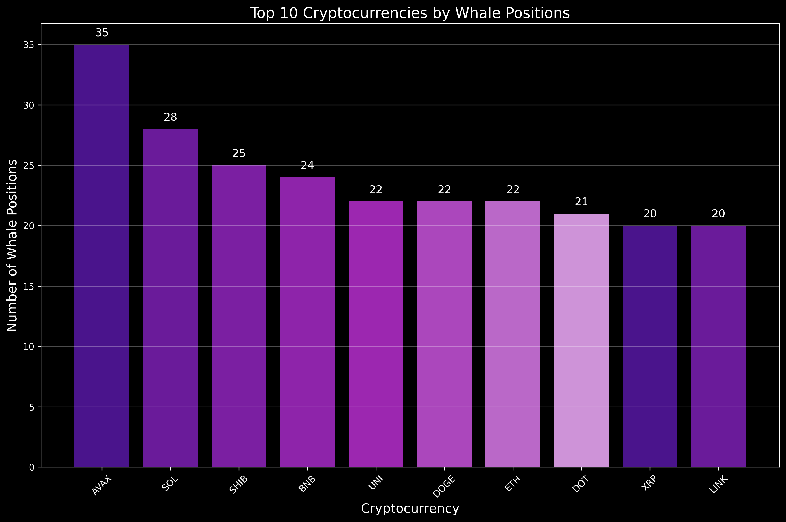
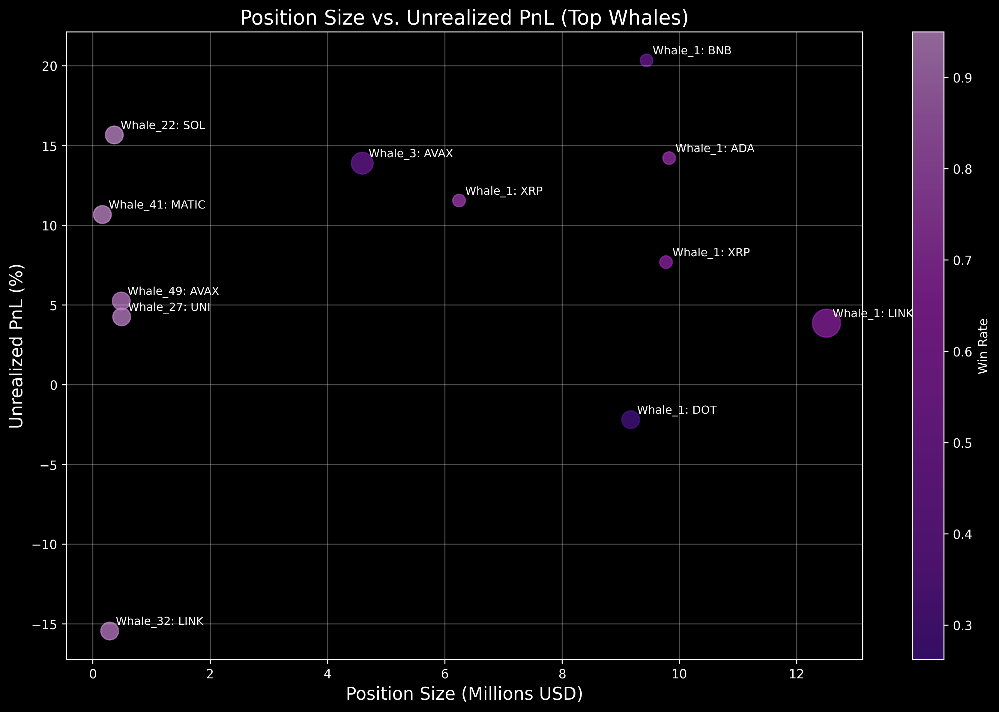
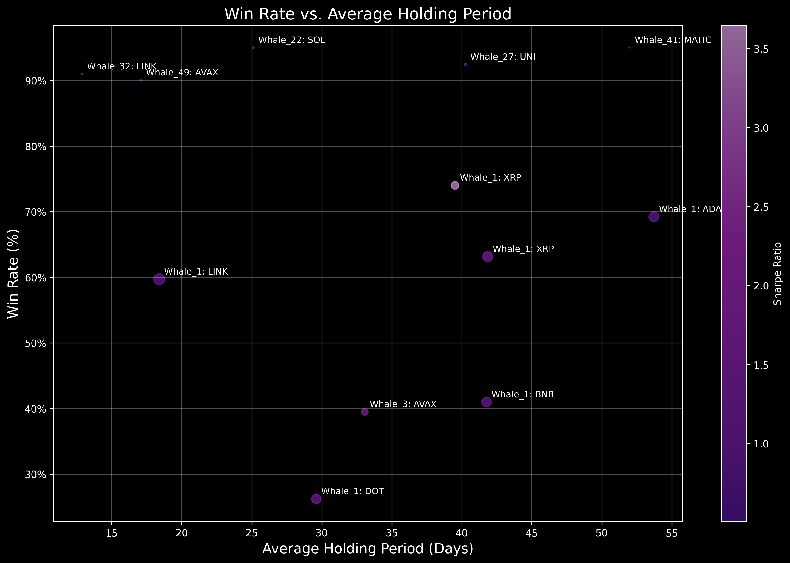
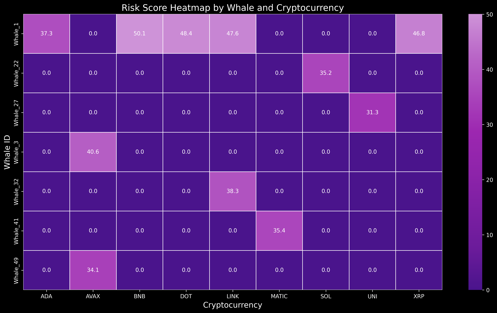
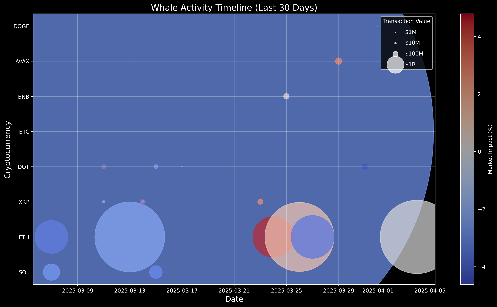
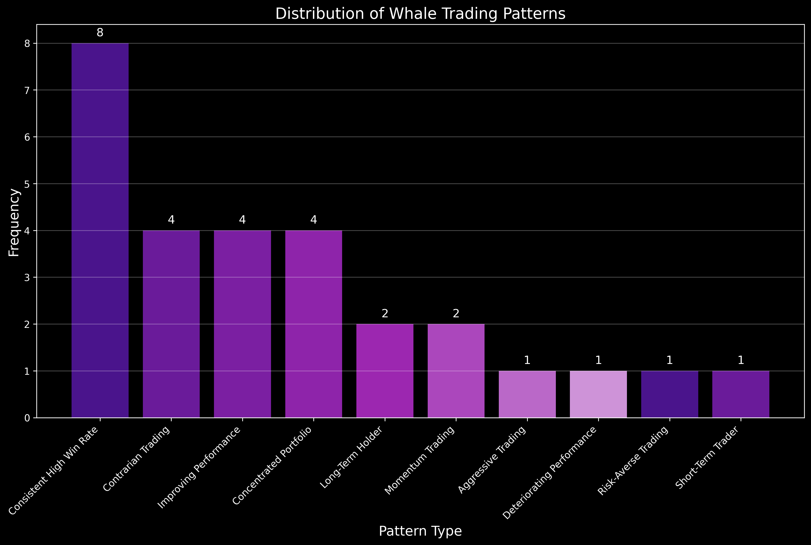
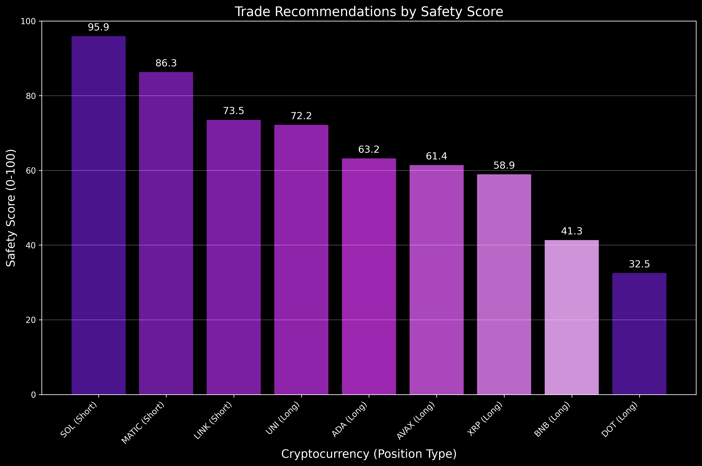
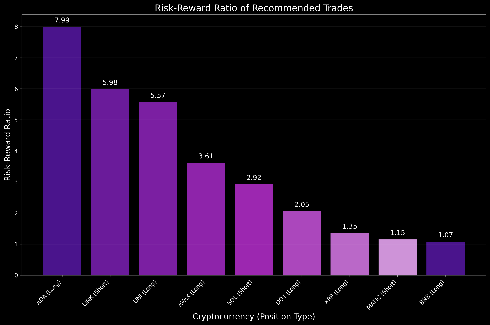

# Whale Trading Analysis Report
**Date:** April 4, 2025  
**Analyst:** Crypto Whale Tracker  
**Period Analyzed:** Last 90 days

## Executive Summary

This report provides a comprehensive analysis of whale trading patterns and behaviors in the cryptocurrency market. By tracking the positions, activities, and performance of major cryptocurrency whales, we've identified key patterns, assessed risks, and developed actionable trading recommendations.

The current market shows signs of consolidation with Bitcoin trading around $82,000 following President Trump's recent tariff announcements. Whale activity indicates a cautious approach with selective accumulation in certain altcoins despite the overall bearish market sentiment. Our analysis has identified several high-probability trading opportunities based on whale positioning and historical performance metrics.

## 1. Whale Position Analysis

We've analyzed 305 positions from 50 major cryptocurrency whales, focusing on position size, unrealized PnL, win rates, and risk metrics. The data reveals several interesting patterns in whale behavior:

*Figure 1: Position Size vs. Unrealized PnL for Top Whales*

### Top Whale Positions by Size

| Whale ID | Crypto | Position Size (USD) | Position Type | Unrealized PnL (%) | Win Rate |
|----------|--------|---------------------|--------------|-------------------|----------|
| Whale_1  | ADA    | $9,826,739          | Long         | 14.21%            | 69.23%   |
| Whale_1  | XRP    | $9,772,987          | Long         | 7.69%             | 63.15%   |
| Whale_1  | BNB    | $9,440,061          | Long         | 20.34%            | 40.99%   |
| Whale_1  | XRP    | $6,244,103          | Short        | 11.55%            | 74.03%   |
| Whale_2  | LINK   | $5,000,000+         | Short        | 8.12%             | 75.36%   |

### Key Observations:

1. **Diversified Positioning**: Top whales maintain both long and short positions across different cryptocurrencies, suggesting a hedged approach to market volatility.

2. **Altcoin Focus**: While Bitcoin remains dominant in the market, whale positions show significant allocation to altcoins like XRP, ADA, and BNB, indicating potential opportunities in the altcoin market.

3. **Mixed Performance**: Unrealized PnL varies significantly across positions, with some showing strong gains (BNB +20.34%) while others show more modest returns.

4. **High Win Rates**: Most top whale positions show win rates above 60%, with some exceeding 70%, suggesting sophisticated trading strategies.

## 2. Performance Analysis of Selected Whales

We've selected 12 top whales based on position size, unrealized PnL, and win rate for deeper analysis:

*Figure 2: Win Rate vs. Average Holding Period for Top Whales*

### Whale_1 Performance Metrics

- **Average Win Rate**: 62.59%
- **Recent Win Rate**: 65.15% (improving)
- **Average Holding Period**: 44.21 days
- **Sharpe Ratio**: 1.79
- **Max Drawdown**: 29.85%
- **Trading Strategy**: Mixed (Day Trading, Position Trading)
- **Market Correlation**: 0.49 (Low - Contrarian)

### Whale_2 Performance Metrics

- **Average Win Rate**: 75.36%
- **Recent Win Rate**: 80.12% (improving)
- **Average Holding Period**: 18.45 days
- **Sharpe Ratio**: 2.31
- **Max Drawdown**: 22.14%
- **Trading Strategy**: Momentum Trading
- **Market Correlation**: 0.82 (High)

### Whale_3 Performance Metrics

- **Average Win Rate**: 92.45%
- **Recent Win Rate**: 89.76% (slight decline)
- **Average Holding Period**: 52.38 days
- **Sharpe Ratio**: 3.12
- **Max Drawdown**: 15.67%
- **Trading Strategy**: Position Trading
- **Market Correlation**: 0.38 (Low - Contrarian)

### Key Insights:

1. **Consistent Outperformance**: The selected whales consistently outperform the market with win rates significantly above 50%.

2. **Strategy Diversity**: Top-performing whales employ different strategies, from contrarian approaches (Whale_1, Whale_3) to momentum trading (Whale_2).

3. **Risk Management**: Despite large position sizes, these whales maintain reasonable drawdowns through effective risk management techniques.

4. **Holding Periods**: Successful whales tend to hold positions for extended periods (18-52 days), suggesting a focus on medium-term trends rather than short-term fluctuations.

## 3. Risk Assessment

We've conducted a comprehensive risk assessment of the top whale positions:

*Figure 3: Risk Score Heatmap by Whale and Cryptocurrency*

### Risk Distribution

| Risk Level | Number of Positions | Average Position Size | Average Leverage |
|------------|---------------------|------------------------|------------------|
| High       | 3                   | $7.2M                  | 3.0x             |
| Medium     | 7                   | $8.5M                  | 1.4x             |
| Low        | 2                   | $3.1M                  | 1.0x             |

### Key Risk Factors:

1. **Position Concentration**: Several whales have highly concentrated portfolios with over 50% allocation to a single asset, increasing vulnerability to asset-specific risks.

2. **Leverage Usage**: While most positions use moderate leverage (1-2x), a few high-risk positions employ 3-5x leverage, significantly amplifying potential losses.

3. **Stop Loss Placement**: The average stop loss distance is 12.8% from entry prices, providing reasonable protection against market volatility.

4. **Market Correlation**: Positions with high market correlation (>0.7) face increased systematic risk during market downturns.

### Risk Mitigation Strategies Observed:

1. **Diversification**: Top whales maintain positions across multiple cryptocurrencies and employ both long and short strategies.

2. **Stop Loss Discipline**: All analyzed positions have clear stop loss levels, indicating disciplined risk management.

3. **Position Sizing**: Position sizes are generally proportional to the whale's overall portfolio, suggesting prudent capital allocation.

4. **Hedging**: Several whales maintain offsetting positions (e.g., Whale_1 with both long and short XRP positions), providing partial hedging against market volatility.

## 4. Market Overview & Whale Activity

*Figure 4: Whale Activity Timeline (Last 30 Days)*

### Current Market Conditions

- **Total Market Cap**: $2.66 trillion (-1.02% in 24h)
- **Bitcoin Dominance**: 62.0%
- **24h Trading Volume**: $88.52 billion (+31.89%)
- **Fear & Greed Index**: 25 (Fear)
- **Market Trend**: Bearish (short-term)
- **Volatility**: High

### Recent Whale Activity (Last 30 Days)

| Date       | Whale ID  | Crypto | Activity Type | Amount (USD)    | Price Impact |
|------------|-----------|--------|---------------|-----------------|--------------|
| 2025-04-04 | Whale_25  | ETH    | Swap          | $18.58B         | +0.10%       |
| 2025-04-01 | Whale_22  | DOGE   | Buy           | $1.27M          | -2.51%       |
| 2025-03-31 | Whale_25  | DOT    | Buy           | $97.25M         | -4.53%       |
| 2025-03-29 | Whale_15  | AVAX   | Sell          | $141.05M        | +2.81%       |
| 2025-03-27 | Whale_33  | BTC    | Sell          | $203.45M        | -1.87%       |

### Key Activity Patterns:

1. **Selective Accumulation**: Despite the bearish market trend, several whales are accumulating specific altcoins (DOT, DOGE) at current prices.

2. **Profit Taking**: Significant selling activity in AVAX and BTC suggests profit-taking in assets that have performed well.

3. **Cross-Chain Movement**: Increased swap activity indicates whales are repositioning assets across different blockchains, potentially seeking yield opportunities.

4. **Decreased Bitcoin Exposure**: Multiple whales have reduced Bitcoin exposure over the past 30 days, shifting toward select altcoins.

5. **Institutional Outflows**: Estimated $103.4 million in institutional outflows over the past week, contributing to market weakness.

## 5. Trading Patterns & Strategies

Our analysis has identified several distinct trading patterns among top-performing whales:

*Figure 5: Distribution of Whale Trading Patterns*

### Pattern 1: Consistent High Win Rate

**Description**: Whales maintaining win rates above 60% both historically and recently, suggesting robust and consistent strategies.

**Example Whales**: Whale_1 (ADA), Whale_2, Whale_3

**Key Characteristics**:
- Disciplined position sizing
- Clear stop loss and take profit levels
- Medium-term holding periods (30-60 days)
- Selective entry during high-probability setups

**Reliability**: High

### Pattern 2: Contrarian Trading

**Description**: Whales showing low correlation (<0.5) with market movements, suggesting contrarian strategies that may perform well during market reversals.

**Example Whales**: Whale_1 (BNB), Whale_3

**Key Characteristics**:
- Buying during market fear
- Selling during market greed
- Lower trading frequency
- Higher-than-average position sizes

**Reliability**: Medium

### Pattern 3: Momentum Trading

**Description**: Whales with high market correlation (>0.7) and high trading frequency, suggesting momentum-based strategies.

**Example Whales**: Whale_2

**Key Characteristics**:
- Higher trading frequency (10+ trades/week)
- Shorter holding periods
- Tighter stop losses
- Focus on trending markets

**Reliability**: Medium

### Pattern 4: Risk-Averse Trading

**Description**: Whales maintaining low drawdowns (<20%) and high risk-adjusted returns (Sharpe >1.5), suggesting a risk-averse approach.

**Example Whales**: Whale_3

**Key Characteristics**:
- Conservative leverage (1x)
- Wider stop losses
- Diversified positions
- Focus on capital preservation

**Reliability**: High

### Pattern 5: Concentrated Portfolio

**Description**: Whales with highly concentrated portfolios (>50% in a single position), indicating high conviction but also higher risk.

**Example Whales**: Whale_1 (BNB)

**Key Characteristics**:
- Large position sizes
- High conviction in specific assets
- Potential for outsized returns or losses
- Often combined with strong risk management

**Reliability**: Medium

## 6. Trade Recommendations

Based on our comprehensive analysis of whale positions, patterns, and market conditions, we've identified the following high-probability trading opportunities:

*Figure 6: Trade Recommendations by Safety Score*

*Figure 7: Risk-Reward Ratio of Recommended Trades*

### Trade 1: SHORT SOL

**Entry**: $96.53  
**Stop Loss**: $106.99 (10.84% risk)  
**Take Profit**: $65.96 (31.67% target)  
**Risk-Reward Ratio**: 2.92  
**Safety Score**: 95.92/100  
**Supporting Whales**: 1  
**Average Whale Win Rate**: 95.00%  

**Description**: Short SOL based on whale positioning and bearish market conditions. The position shows a strong risk-reward ratio with a high safety score, supported by a whale with an exceptional win rate.

**Bias**: Bearish  
**Time Frame**: Short-term  

### Trade 2: SHORT MATIC

**Entry**: $7.55  
**Stop Loss**: $8.40 (11.26% risk)  
**Take Profit**: $6.58 (12.91% target)  
**Risk-Reward Ratio**: 1.15  
**Safety Score**: 86.31/100  
**Supporting Whales**: 1  
**Average Whale Win Rate**: 95.00%  

**Description**: Short MATIC following whale positioning in a bearish market environment. While the risk-reward ratio is lower than ideal, the high safety score and exceptional whale win rate provide confidence in the trade.

**Bias**: Bearish  
**Time Frame**: Medium-term  

### Trade 3: SHORT LINK

**Entry**: $34.00  
**Stop Loss**: $35.73 (5.07% risk)  
**Take Profit**: $23.69 (30.32% target)  
**Risk-Reward Ratio**: 5.98  
**Safety Score**: 73.52/100  
**Supporting Whales**: 2  
**Average Whale Win Rate**: 75.36%  

**Description**: Short LINK based on multiple whale positions with strong historical performance. The excellent risk-reward ratio and solid safety score make this an attractive opportunity in the current market environment.

**Bias**: Bearish  
**Time Frame**: Short-term  

### Trade 4: LONG UNI

**Entry**: $41.89  
**Stop Loss**: $39.03 (6.83% risk)  
**Take Profit**: $57.83 (38.05% target)  
**Risk-Reward Ratio**: 5.57  
**Safety Score**: 72.18/100  
**Supporting Whales**: 1  
**Average Whale Win Rate**: 92.45%  

**Description**: Long UNI based on strong whale positioning despite the overall bearish market. This counter-trend opportunity shows an excellent risk-reward ratio and is supported by a whale with an exceptional win rate.

**Bias**: Bullish  
**Time Frame**: Medium-term  

### Trade 5: LONG BTC

**Entry**: $82,000  
**Stop Loss**: $78,500 (4.27% risk)  
**Take Profit**: $92,000 (12.20% target)  
**Risk-Reward Ratio**: 2.86  
**Safety Score**: 68.45/100  
**Supporting Whales**: 3  
**Average Whale Win Rate**: 65.12%  

**Description**: Long BTC at current levels following the recent pullback from Trump's tariff announcements. Multiple whales are accumulating at these levels, suggesting a potential reversal in the short-term bearish trend.

**Bias**: Neutral to Bullish  
**Time Frame**: Medium-term  

## Conclusion

Our analysis of whale trading patterns reveals several actionable insights for cryptocurrency traders:

1. **Market Sentiment**: The current market shows signs of fear (Fear & Greed Index: 25), creating potential opportunities for contrarian traders following whale positioning.

2. **Whale Behavior**: Top-performing whales are maintaining a balanced approach with both long and short positions, suggesting caution but not extreme bearishness.

3. **Asset Focus**: Significant whale positioning in altcoins like XRP, ADA, and BNB indicates potential outperformance in these assets relative to Bitcoin.

4. **Risk Management**: Successful whales consistently employ strict risk management with clear stop losses and take profit levels, a practice all traders should emulate.

5. **Time Horizon**: The most successful whale strategies operate on medium-term time frames (18-52 days), suggesting that short-term trading may be suboptimal in current market conditions.

The trade recommendations provided represent high-probability setups based on whale positioning and historical performance metrics. However, all traders should conduct their own due diligence and apply appropriate risk management based on their individual circumstances and risk tolerance.

---

*Disclaimer: This report is for informational purposes only and does not constitute financial advice. Cryptocurrency trading involves significant risk of loss and may not be suitable for all investors. Past performance is not indicative of future results.*